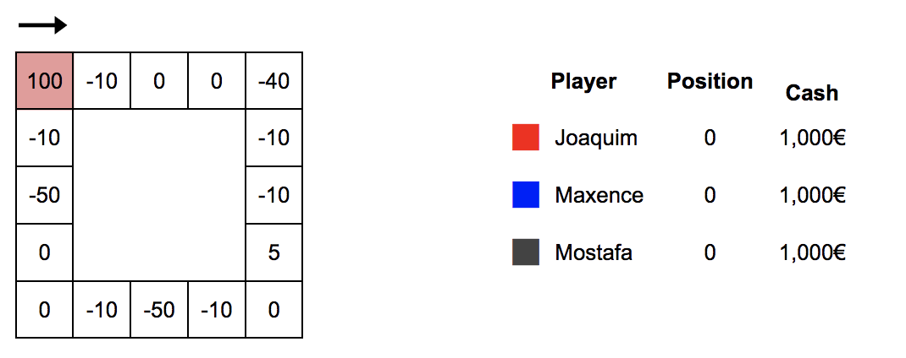

# W1D5

## Object-oriented programming (OOP)

- Understand the concept of object oriented programming
- Learn how to use classes to create objects
- Learn how to inherit attributes and methods from a parent class

- Examples:
  - Monopoly game

